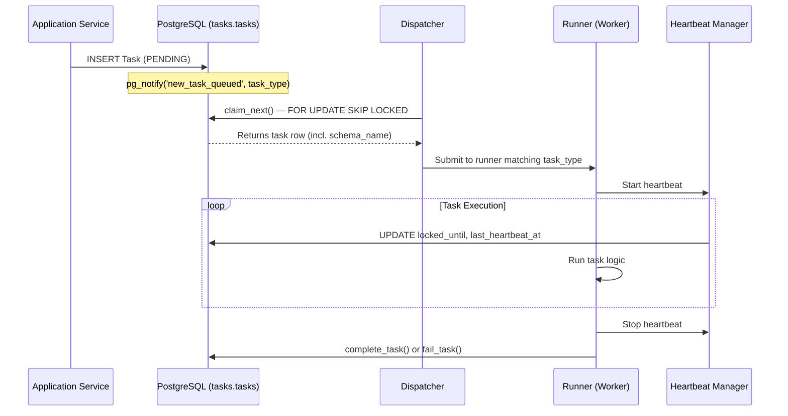

# The Asynchronous Task & Event Ecosystem

The asynchronous task ecosystem is a cornerstone of Agro-Informatics Platform (AIP) - Catalog Services's resilience and scalability, embodying the "Tasks" pillar of the architecture. It provides a robust framework for offloading long-running operations from the synchronous API request loop.

## The `tasks` Module: The Central Nervous System
The `tasks` module is the heart of the asynchronous ecosystem. It acts as a centralized, transactional ledger and status tracker. It does **not** execute jobs itself.

- **Ownership:** Exclusively owns the global `tasks.tasks` and `tasks.events` tables (Date RANGE partitioned).
- **Task Registration:** `enqueue` / `create_task` ensures monthly partitions exist and inserts a `PENDING` record securely, with optional deduplication via `dedup_key`.
- **Status Tracking:** Exposes `update_task` and synchronous `update_task_sync` to allow remote workers to report progress.
- **Monitoring API:** Handles backend lookups for the generic read-only monitoring statuses.

## Global Table Architecture

All tasks live in a **single global `tasks.tasks` table** partitioned by timestamp. This replaces the former per-tenant `"{schema}".tasks` tables, which could not scale beyond a few hundred catalogs without requiring expensive schema discovery on every dispatcher cycle.

### Schema Design

```
tasks.tasks
├── task_id           UUID          (PK with timestamp)
├── schema_name       VARCHAR(255)  -- tenant identifier ("s_abc123" or "system")
├── scope             VARCHAR(50)   -- CATALOG | SYSTEM | ASSET
├── execution_mode    VARCHAR       -- SYNCHRONOUS | ASYNCHRONOUS
├── task_type         VARCHAR       -- e.g. "ingestion", "gcp_provision"
├── status            VARCHAR       -- PENDING → ACTIVE → COMPLETED/FAILED/DEAD_LETTER
├── dedup_key         VARCHAR(512)  -- optional, UNIQUE partial index
├── inputs/outputs    JSONB
├── locked_until      TIMESTAMPTZ   -- visibility timeout for heartbeat
├── owner_id          VARCHAR(255)  -- which instance claimed it
├── retry_count/max_retries INT
└── timestamp         TIMESTAMPTZ   -- creation time, partition key
```

The `schema_name` column identifies the tenant; `scope` distinguishes CATALOG / SYSTEM / ASSET tasks. A partial unique index on `dedup_key` prevents duplicate tasks from the same event.

### Events Outbox

The `tasks.events` table provides a durable outbox for domain events:

```
tasks.events
├── event_id          UUID          (PK with created_at)
├── event_type        VARCHAR       -- e.g. "task.failed", "catalog.deleted"
├── scope             VARCHAR(50)   -- PLATFORM | CATALOG | COLLECTION | ASSET
├── schema_name       VARCHAR(255)
├── payload           JSONB
├── status            VARCHAR       -- PENDING → PROCESSING → (deleted on ack)
├── dedup_key         VARCHAR(512)
└── created_at        TIMESTAMPTZ   -- partition key
```

Consumed events are **deleted** after successful processing (acked). Failed events are retried up to 5 times before being moved to `DEAD_LETTER`.

## Queue / Dispatch Architecture

### Leader-Election LISTEN
One instance per **service type** (by `NAME` env var) wins a session-level
PostgreSQL advisory lock (`pg_try_advisory_lock`) and becomes the LISTEN
leader. It holds a single asyncpg `LISTEN` socket on `new_task_queued`,
`task_status_changed`, and `dynastore_events_channel`.

Follower instances emit a periodic signal-bus event to wake the dispatcher
for a claim sweep. Both paths emit `signal_bus` events so the Dispatcher
loop is identical regardless of instance role.

Benefits:
- **One** LISTEN connection per service type regardless of replica count.
- No relay table needed — the global tasks table is the single source of truth.
- No thundering-herd: SKIP LOCKED ensures exactly-once task claiming.

### Runner-Aware Task Claiming

At startup, a `CapabilityMap` is built by querying each runner's
`can_handle()` method. The dispatcher's `claim_next()` query filters
by `(execution_mode, task_type)` pairs so each service only claims tasks
it can actually execute.

```sql
UPDATE tasks.tasks
SET status = 'ACTIVE', locked_until = :locked_until, owner_id = :owner_id
WHERE (timestamp, task_id) = (
    SELECT timestamp, task_id FROM tasks.tasks
    WHERE status = 'PENDING'
      AND (locked_until IS NULL OR locked_until <= NOW())
      AND (
          (execution_mode = 'ASYNCHRONOUS' AND task_type = ANY(:async_types))
          OR
          (execution_mode = 'SYNCHRONOUS' AND task_type = ANY(:sync_types))
      )
    ORDER BY timestamp ASC LIMIT 1
    FOR UPDATE SKIP LOCKED
)
RETURNING task_id, schema_name, scope, task_type, execution_mode, ...;
```

### Runner Priority Chain

| Runner | Priority | `can_handle()` | Mode |
|---|---|---|---|
| `GcpCloudRunRunner` | 10 | `task_type in self._job_map_cache` | ASYNC |
| `BackgroundRunner` | 100 | `get_task_instance(task_type) is not None` | ASYNC |
| `SyncRunner` | 100 | `get_task_instance(task_type) is not None` | SYNC |

On-premise environments have no `GcpCloudRunRunner` — tasks fall through to `BackgroundRunner` transparently.

### BatchedHeartbeat
A single coroutine fires one `UPDATE … WHERE task_id = ANY(…)` per 30 s
interval across the global table, replacing per-task heartbeat transactions.

### Automatic Event Consumer
After all modules initialize, the event consumer starts automatically if
any module registered async event listeners (`has_listeners()`). No env
var is needed — modules opt in declaratively by registering listeners.
Two instances shipping the same module both start consumers; `FOR UPDATE SKIP LOCKED` ensures only one processes each event.

## Task Lifecycle



### Failure & Retry

When a task fails:
- If `retry_count < max_retries`: reset to `PENDING` with exponential backoff (`2^retry_count` seconds)
- If retries exhausted: move to `DEAD_LETTER` (requires manual intervention via admin endpoint)

### Janitor

A global janitor runs on each dispatcher wakeup cycle (throttled):
1. **Stale task recovery:** Finds `ACTIVE` tasks with expired `locked_until` (dead workers) and requeues or dead-letters them.
2. **Orphan cleanup:** Dead-letters tasks whose `schema_name` no longer exists in `catalog.catalogs` (catalog was deleted).

## Deduplication

Both tasks and events support a `dedup_key` column with a partial unique index:

```sql
-- Tasks: prevents duplicate tasks for non-terminal states
CREATE UNIQUE INDEX idx_tasks_dedup ON tasks.tasks (dedup_key)
    WHERE dedup_key IS NOT NULL AND status NOT IN ('COMPLETED', 'FAILED', 'DEAD_LETTER');

-- Events: prevents duplicate events
CREATE UNIQUE INDEX idx_events_dedup ON tasks.events (dedup_key)
    WHERE dedup_key IS NOT NULL AND status NOT IN ('DEAD_LETTER');
```

Event handlers that create tasks include `dedup_key = f"evt:{event_id}:{task_type}"` to prevent duplicates even if two instances race on the same event.

## Data Lifecycle

| Data | Default Retention | Mechanism |
|---|---|---|
| COMPLETED tasks | 30 days | Monthly partition DROP |
| FAILED tasks | 30 days | Monthly partition DROP |
| DEAD_LETTER tasks | 90 days | Separate retention window |
| PENDING/ACTIVE (stale) | visibility_timeout | Janitor requeues or dead-letters |
| Consumed events | Immediate | DELETE after processing |
| Dead letter events | 30 days | pg_cron cleanup |

Partition management: `pg_cron` creates monthly partitions 12 months ahead and drops expired ones.

## The `ingestion` Extension: The Gateway
The primary user-facing orchestration endpoint: `POST /ingestion/{catalog_id}/{collection_id}`.

1. **Validation (Fail-Fast):** Contacts the catalog to ensure a physical `LayerConfig` exists.
2. **Task Creation:** Tells the `tasks` module to create a record saving the file path and metadata mapping.
3. **Dispatch:** Triggers `FastAPI` background tasks or remote containers.
4. **Immediate Response:** Reverses out instantly with a `202 Accepted` offering the client a `status_url`.

## Registered Task Types

| Entry-point key | Class | Description |
|---|---|---|
| `gdal` | `GdalInfoTask` | Runs `gdalinfo` on an asset |
| `gcp_provision` | `ProvisioningTask` | Creates/verifies GCS bucket + eventing for a catalog |
| `gcp_catalog_cleanup` | `GcpCatalogCleanupTask` | Tears down GCP resources on catalog/collection hard-deletion |
| `gcs_storage_event` | `GcsStorageEventTask` | Reacts to GCS Pub/Sub object events (create/delete/archive assets) |
| `elasticsearch` | `ElasticsearchIndexTask` | Indexes items into Elasticsearch |
| `ingestion` | `IngestionTask` | Full ingestion pipeline |
| `dwh_join` | `DwhJoinExportTask` | Data-warehouse join export |
| `export_features` | `ExportFeaturesTask` | Feature export |
| `tiles_preseed` | `TilePreseedTask` | Tile cache pre-seeding |
| `event_dispatch` | `EventDispatchTask` | Dispatches catalog lifecycle events to subscribers |
| `webhook_delivery` | `WebhookDeliveryTask` | HTTP delivery of event payloads to subscriber webhooks |

## The `ReportingInterface` Pattern
Tasks use a Strategy Pattern to handle complex reporting without polluting ingestion processing code.
- **DatabaseStatusReporter:** Batches API completion back down to the DB `progress` column integers.
- **GcsDetailedReporter:** Stores granular row-by-row pass/fails in memory and pushes them into an external Cloud Storage Bucket strictly at the `task_finish` bound.

## Generic Execution via `main_task.py`
A generic worker. It boots up looking for command line constants `task_name` and `payload`.
It initiates required system constants by iterating the `DYNASTORE_MODULES` config, mapping the required dependencies, bridging synchronous databases, and dynamically invoking mapped functions based on the payload string cleanly avoiding rewriting infrastructure for every new async script operation.
