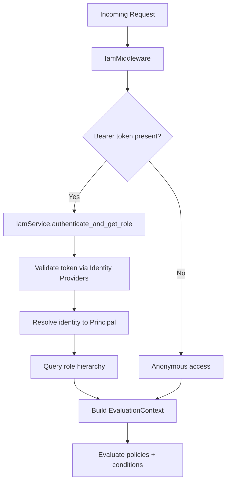

# IAM Module (Developer Documentation)

The `IAM` module is the core Identity and Access Management (IAM) component of DynaStore. It provides a generalized framework for managing principals, dynamic roles, and fine-grained access policies.

## Architecture

The module follows a pluggable SPI architecture, separating business logic from storage implementations.

### Core Components
- **`IamService`**: The central coordinator for identity-related operations (authentication, principal resolution, role hierarchy).
- **`PolicyService`**: Manages the lifecycle and evaluation of global system policies.
- **`AbstractIamStorage` / `AbstractPolicyStorage`**: SPI definitions for persistence.
- **`ConditionRegistry`**: A specialized engine for evaluating complex rules (Time Windows, Attribute Matching, Logical operators).

## Multi-Tenancy & Schema Strategy

The module uses a multi-tiered schema approach to ensure isolation while allowing global administration:

- **`iam` schema**: Stores global principals, roles, policies, and cross-tenant identity links. This is the fallback schema if no catalog context is provided.
- **Tenant schemas**: Individual tenant schemas store their own principals and policies.

Identity resolution is handled via the `_resolve_schema(catalog_id)` helper. If a `catalog_id` is provided, the manager attempts to resolve its physical schema. If not found, it defaults to the `iam` schema.

## Role-Based Access Control (RBAC)

The module supports dynamic RBAC with the following features:
- **Dynamic Roles**: Roles can be created at runtime with different privilege levels.
- **Hierarchies**: Roles can inherit permissions from other roles (e.g., `sysadmin` -> `admin` -> `authorized`). In this model, the **parent inherits the child's permissions**.
- **System Admin**: A `sysadmin` role with elevated privileges, managed via an external Identity Provider (e.g., Keycloak realm admin).
- **Platform System User**: A constant `SYSTEM_USER_ID` (`system:platform`) used for unauthenticated background tasks (e.g., CLI-initiated tasks).

## Authentication

Authentication is delegated to external Identity Providers (IdP) via the `IdentityProviderProtocol`. The module is IdP-agnostic:
- Any OIDC-compliant provider (Keycloak, Auth0, Azure AD, etc.) can be registered.
- The `IamService.authenticate_and_get_role()` method iterates registered providers to validate JWT tokens.
- Identity links (`identity_links` table) map external identities (provider + subject_id) to internal principals.

## Policy Evaluation Logic

Policies are evaluated in a hierarchical manner with clear precedence:

1.  **Deny overrides Allow**: If any matching policy has an `ACTION: DENY`, access is immediately refused.
2.  **Priority-based**: Higher priority values (e.g., 2000) take precedence over lower ones (e.g., 1000).
3.  **Global > Local**: System-wide policies are checked after Principal policies to provide a final governance layer.

### Order of Evaluation:
1.  **Principal Policy**: Permissions attached to the user/identity.
2.  **Global System Policies**: Broad rules defined by administrators.

## Configuration

The module is configured via environment variables and shared system properties:

| Name | Source | Description |
|------|--------|-------------|
| `JWT_SECRET` | Shared Property (`iam_jwt_secret`) | Signing key for JWT tokens. Auto-generated if missing. |
| `KEYCLOAK_ISSUER_URL` | Environment | IdP issuer URL for OIDC token validation. |
| `KEYCLOAK_CLIENT_ID` | Environment | IdP client ID. |
| `KEYCLOAK_PUBLIC_URL` | Environment | Browser-reachable IdP URL (may differ from internal). |

## Use Cases

### Cloud-Native Authorization (OIDC)
Identity is managed externally (Keycloak or any OIDC IdP), but fine-grained authorization (roles/policies) is managed by DynaStore.
- **User Flow**: User logs in via IdP -> Receives IdP JWT -> DynaStore validates token, resolves identity to local roles/policies.

## Workflow: Permission Resolution at Runtime

## Lifecycle Management
The `lifespan` method in `IamModule` handles initialization of the IAM schema (via `DDLBatch` with sentinel pattern for fast warm starts) and registration of identity providers.

## SPI Implementation

To implement a new storage driver:
1.  Inherit from `AbstractIamStorage` or `AbstractPolicyStorage`.
2.  Implement all async methods (CRUD, search, hierarchy resolution).
3.  Register the new driver in the module configuration.
