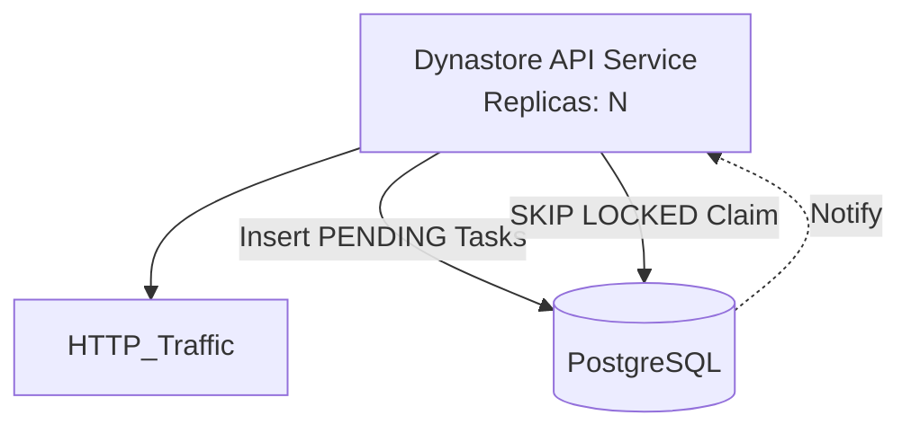
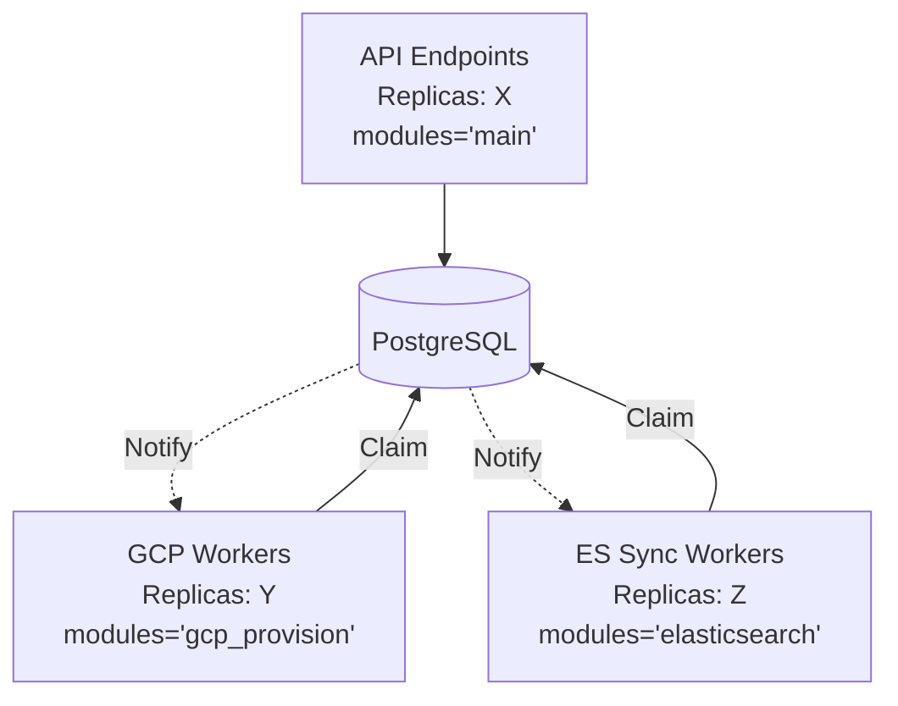

# DynaStore Distributed Task System Architecture

The DynaStore Distributed Task System provides durable, resilient execution of background workloads (like STAC aggregations, Elasticsearch syncing, or GCP provisioning). It is built on PostgreSQL, taking advantage of its advanced transactional and native notification features to achieve scale and reliability **without using periodic polling**.

## Core Design Principles

1.  **Durable State & Source of Truth:**
    All tasks are stored in PostgreSQL `tasks` tables (partitioned by time). The database guarantees task safety and tracking, making state easily observable natively through standard querying or utility wrappers.

2.  **Event-Driven (Zero-Polling) Activation:**
    Worker nodes and API services do not pull the database at intervals looking for work. Instead, they leverage PostgreSQL's `LISTEN/NOTIFY` (via `asyncpg`).
    *   When an application inserts a new task (e.g. `PENDING`), a DB trigger emits a `pg_notify('new_task_queued', schema)`.
    *   The `QueueListener` in every connected worker instantly receives this signal across a persistent channel and wakes up the `Dispatcher`.
    *   This results in near-instantaneous scaling and zero idle DB load.

3.  **Contention-Free Dispatching:**
    When multiple workers wake up upon receiving a signal, they attempt to claim a task.
    They execute `SELECT ... FOR UPDATE SKIP LOCKED`.
    *   This forces the PostgreSQL engine to find the first unlocked row meeting the criteria and lock it for the requesting worker, while skipping it for all other concurrent workers.
    *   There are **no software locks**, wait times, or deadlocks during dispatching. It scales horizontally across arbitrarily large replica counts.

## System Components

### 1. The QueueListener (`queue.py`)
Responsible for keeping lightweight long-lived unbuffered listener endpoints open against the PostgreSQL installation. Emits internal `signal_bus` Python events whenever a physical trigger arrives from the DB across `NEW_TASK_QUEUED` or `TASK_STATUS_CHANGED` channels.

### 2. The Dispatcher (`dispatcher.py`)
Sleeps until interrupted by the `signal_bus`. Upon awakening, it:
*   Collects a `PENDING` task utilizing `SKIP LOCKED`.
*   Marks the task as `ACTIVE` with a unique `owner_id` and `locked_until` lease.
*   Passes it to the matching registered Background Executor (`runners.py`).

### 3. The HeartbeatManager
To prevent active tasks from being incorrectly reclaimed while they are legitimately working (but taking a long time), a `HeartbeatManager` runs concurrently with long tasks, periodically advancing the `locked_until` column lease.

### 4. The Janitor
Embedded into the Dispatcher loop, it periodically scans (conservatively) for `ACTIVE` tasks whose `locked_until` lease has expired in the past without a heartbeat, resetting them to `PENDING` so they can be retried (up to max retries) or transitioning them to `DEAD_LETTER`.

## Database Partitioning Model

Tasks are horizontally segregated to ensure load on one sub-system or tenant does not throttle others.

*   **System Scale (Global):**
    Tasks governing the instance logic (e.g., maintaining global settings, provisioning entirely new environments) run against the central `tasks.tasks` table.

*   **Catalog Scale (Tenant Isolation):**
    Each dynamically minted logical Catalog holds its own physical isolated schema (`s_<catalog_id>.tasks`). This bounds the query size per tenant, and isolates schema-drop and `TRUNCATE` lifecycles on catalog tear-down perfectly.

*   **Collection Scale (Logical grouping):**
    Specific entity jobs (such as importing items to a STAC collection) share the Catalog's schema task table but are partitioned by `collection_id` for tracking and rollback granularity.

## Multi-Application Deployments

Because execution requires no centralized master broker (every application is conceptually a peer worker against the PostgreSQL source of truth), the architecture supports fully flexible cloud and on-premise execution modes. 
Furthermore, the codebase remains identical; execution modes are dictated solely through startup parameters.

### Unified Mono-Service
A single application handles incoming web API requests, while simultaneously reserving background context slots to run executors. A single deployment configuration maps well for smaller instances. 

### Specialized Independent Workers
In high-throughput environments, deploying distinct decoupled units ensures API latency isn't starved by compute-heavy logic. By configuring `DYNASTORE_TASK_MODULES` correctly on boot, different deployments act divergently over the identical code.

*   **API Pods**: Insert tasks into the schema but possess no `dispatcher` running, hence ignore the `.notify` wake-up calls entirely.
*   **Specialized Pods**: Wake up on notify, claim uniquely bound sub-domains based on their active task loaders.

## Cloud vs On-Premise Neutrality

Because all signals flow uniquely through standard asynchronous Python to PostgreSQL and back, the framework exhibits robust cloud neutrality.
- **On GCP**: Cloud pubsub queues might natively kickstart entrypoint functions that register internal PG tasks. 
- **On Premise**: Same code. The API handles ingest, directly pushes the exact same internal PG tasks without external GCP Pub/Sub mediation, and identical independent ES/STAC local workers pick them up safely and without locking configurations.

## Handling Testing & Teardown

During highly parallel Pytest execution, dropping catalogs introduces complexities because tests shouldn't conflict tearing down shared state (such as task tables).
*   **Initialization Integrity**: Shared system-level DDL initialization uses specific `pg_advisory_lock` primitives (in `locking_tools.py`), ensuring sequential access when bootstrapping tables before actual code execution.
*   **Safe Completion Settlement**: In tests, `wait_for_all(schema)` uses small batched read `UNION ALL` validation sweeps to guarantee all tasks actually finish before schemas are dropped so no `relation does not exist` background noise errors pollute test stdout.
