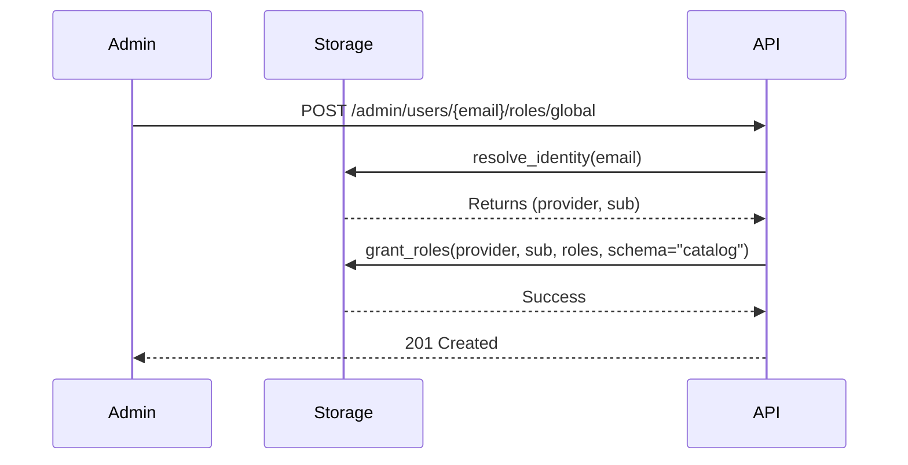

# ApiKey Module (Developer Documentation)

The `ApiKey` module is the core Identity and Access Governance (IAG) component of DynaStore. It provides a generalized framework for managing principals, API keys, dynamic roles, and fine-grained access policies.

## Architecture

The module follows a pluggable SPI architecture, separating business logic from storage implementations.

### Core Components
- **`ApiKeyManager`**: The central coordinator for all identity-related operations (authentication, token exchange, key management).
- **`PolicyManager`**: Manages the lifecycle and evaluation of global system policies.
- **`AbstractApiKeyStorage` / `AbstractPolicyStorage`**: SPI definitions for persistence.
- **`ConditionManager`**: A specialized engine for evaluating complex rules (Rate Limits, Quotas, Time Windows).
- **`UsageAggregator`**: An internal `KeyValueAggregator` that buffers and aggregates usage increments to minimize DB load.

## Multi-Tenancy & Schema Strategy

The module uses a multi-tiered schema approach to ensure isolation while allowing global administration:

- **`apikey` schema**: Stores global tracking data (usage counters) and global cross-tenant keys. This is the fallback schema if no catalog context is provided.
- **Tenant schemas**: Individual tenant schemas store their own principals, keys, and policies.

Identity resolution is handled via the `_resolve_schema(catalog_id)` helper. If a `catalog_id` is provided, the manager attempts to resolve its physical schema. If not found, it defaults to the `apikey` schema.

## High-Throughput Accounting

To handle high-throughput scenarios, the module implements background buffering for usage increments:

- **`AsyncBufferAggregator`**: A generic utility for batching async operations.
- **`KeyValueAggregator`**: A specialized aggregator that sums up numeric values for the same key (e.g., `key_hash + period`).
- **Configuration**:
    - `USAGE_BUFFER_THRESHOLD`: Flush after N increments (Default: 100).
    - `USAGE_BUFFER_INTERVAL`: Flush every N seconds (Default: 5).

## Role-Based Access Control (RBAC)

The module supports dynamic RBAC with the following features:
- **Dynamic Roles**: Roles can be created at runtime with different privilege levels.
- **Hierarchies**: Roles can inherit permissions from other roles (e.g., `sysadmin` -> `admin` -> `authorized`). In this model, the **parent inherits the child's permissions**.
- **System Admin**: A special `sysadmin` role that bypasses standard policy checks if a valid system key is provided.
- **Platform System User**: A constant `SYSTEM_USER_ID` (`system:platform`) used for unauthenticated background tasks (e.g., CLI-initiated tasks).

## Principal Model Compatibility

The `Principal` model provides property mappings to ensure compatibility with various module versions:
- `identifier`: Returns the unique ID of the principal (syncs to `id`).
- `metadata`: Returns the dictionary of ABAC attributes (syncs to `attributes`).

## Policy Evaluation Logic

Policies are evaluated in a hierarchical manner with clear precedence:

1.  **Deny overrides Allow**: If any matching policy has an `ACTION: DENY`, access is immediately refused.
2.  **Priority-based**: Higher priority values (e.g., 2000) take precedence over lower ones (e.g., 1000).
3.  **Global > Local**: System-wide policies are checked after Key/Principal policies to provide a final governance layer.

### Order of Evaluation:
1.  **API Key Policy**: Fixed limits attached to the credential.
2.  **Principal Policy**: Permissions attached to the user/identity.
3.  **Global System Policies**: Broad rules defined by administrators.

## Configuration

The module is configured via environment variables and shared system properties:

| Name | Source | Description |
|------|--------|-------------|
| `JWT_SECRET` | Shared Property | Signing key for JWT tokens. Auto-generated if missing. |
| `USAGE_BUFFER_THRESHOLD` | Env/Defaults | Batch size for usage accounting flushes. |
| `USAGE_BUFFER_INTERVAL` | Env/Defaults | Time interval for usage accounting flushes. |

## Use Cases

### 1. Cloud-Native Authorization (OIDC Hybrid)
Identity is managed externally (Keycloak), but fine-grained authorization (roles/policies) is managed by DynaStore. 
- **User Flow**: User logs in via Keycloak -> Receives DynaStore JWT -> DynaStore resolves identities to local `catalog` or `{tenant}` roles.

### 2. On-Premise Identity Management
Fully self-contained identity and access governance using the `users` schema.
- **User Flow**: Admin creates user via `/admin/users` -> User authenticates via `/auth/login` -> User manages own roles via `/me/roles`.

## Workflow: Granting Access to a New User



## Workflow: Permission Resolution at Runtime

```mermaid
flowchart TD
    A[Incoming Request] --> B[ApiKeyMiddleware]
    B --> C{identity in state?}
    C -- Yes --> D[ApiKeyManager.get_effective_permissions]
    D --> E[Query global roles from 'catalog']
    E --> F[Query catalog roles from '{tenant}']
    F --> G[Merge Roles & Policies]
    G --> H[Create runtime Principal]
    H --> I[Execute Context Logic]
```

## Lifecycle Management
The `lifespan` method in `ApiKeyModule` handles the initialization and graceful shutdown of the aggregators and caches. Developers must ensure that `manager.shutdown()` is called to flush any remaining buffered data before the application exits.

## SPI Implementation

To implement a new storage driver:
1.  Inherit from `AbstractApiKeyStorage` or `AbstractPolicyStorage`.
2.  Implement all async methods (CRUD, search, hierarchy resolution).
3.  Register the new driver in the module configuration.